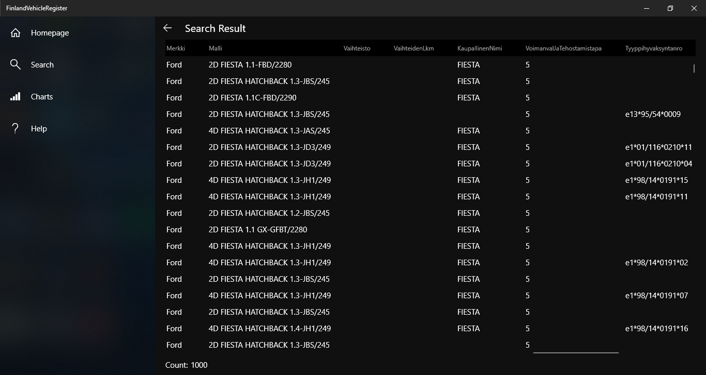

# KL-ohjelmointi harjoitustyö

Toteutettu osana Käyttöliittymä ohjelmointi kurssia C#-kielellä.

Docs: https://github.com/JonneOkkonen/FinlandVehicleRegister/tree/master/docs

HUOM!  
API-rajapinta ei ole käytettävissä enää.  

Tekijät: 
- Jonne Okkonen, TTV18S3
- Joonas Niinimäki, TTV18S3

## HomePage

## SearchPage

## ChartsPage

## HelpPage

