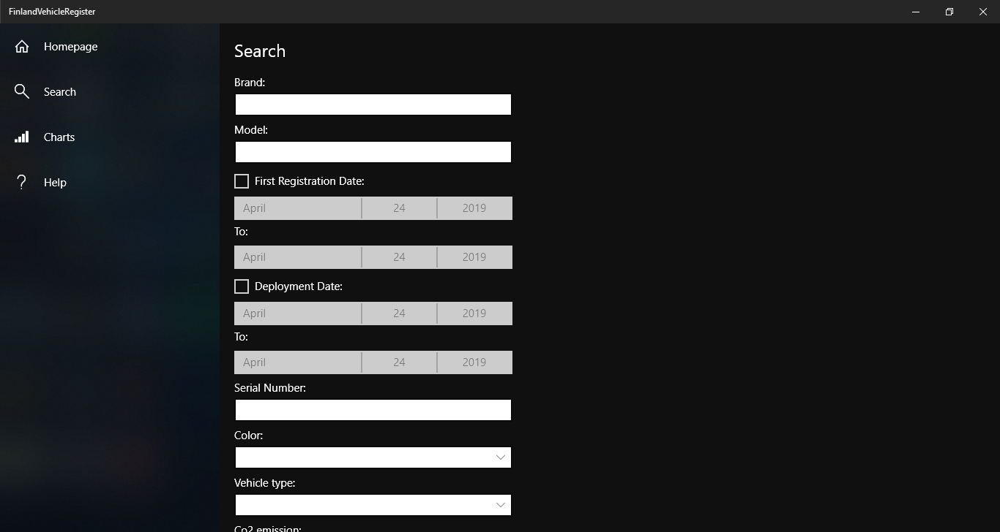
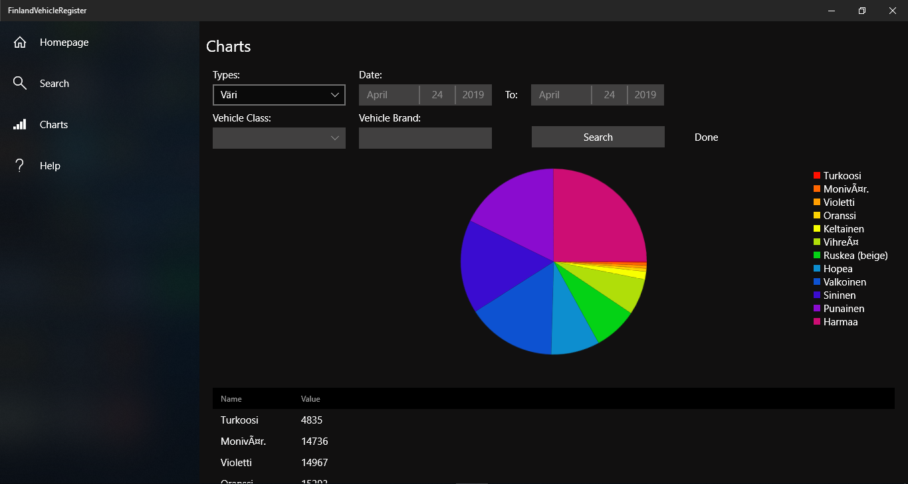

# KL-ohjelmointi harjoitustyö

Toteutettu osana Käyttöliittymä ohjelmointi kurssia C#-kielellä.

Tekijät: 
- Jonne Okkonen, TTV18S3
- Joonas Niinimäki, TTV18S3

## HomePage

## SearchPage

## ChartsPage

## HelpPage

