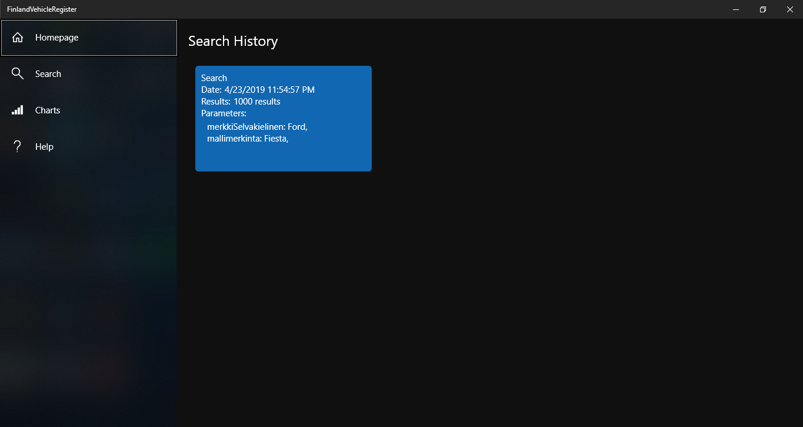
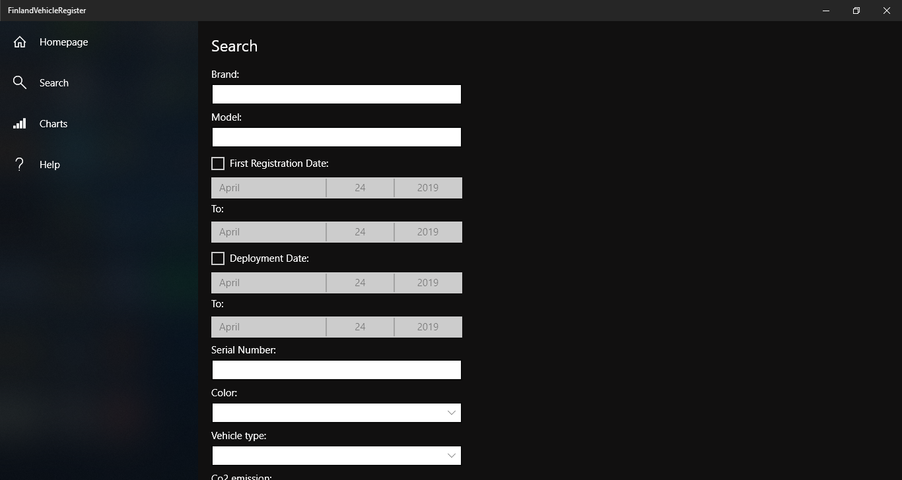
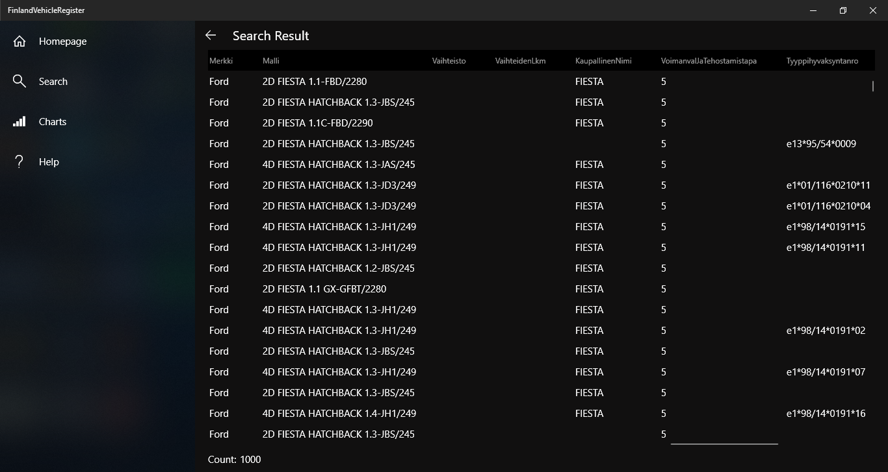
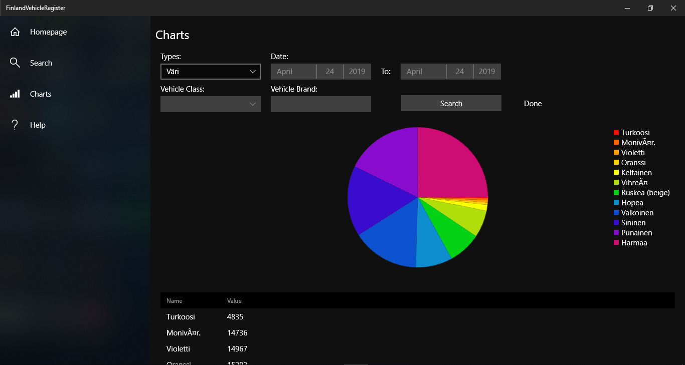
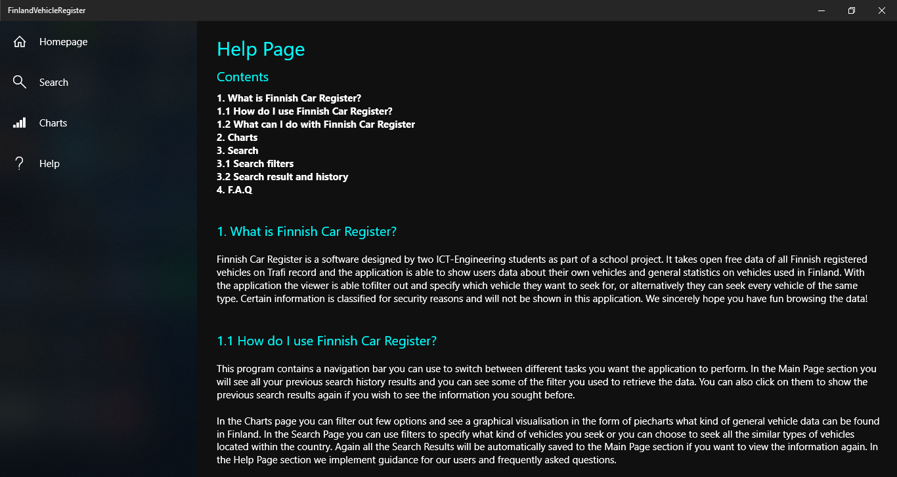

# Loppuraportti

## 1. Asennus
- Asennus tehdään sideloading menetelmällä.
- Varmista, että developer mode on kytketty päälle. Settings->Update&Security->ForDevelopers->Developer Mode
- Luo Windows App Certification Kit avulla testi sertifikaatti ohjelmalle
- Käytä Validate Store App vaihtoehtoa
- Valitse App Package tiedosto ja validoi ohjelma
- Avaa App Package tiedosto ja aloita asennus
- Asennuksen päätyttyä ohjelman tulisi avautua automaattisesti

## 2. Tietoa ohjelmasta
- Ohjelmisto on Suomen ajoneuvojen rekisteri. Tieto on saatu Trafin rekisteristä avoin data sivulta. Sen avulla voidaan hakea yksittäisiä ajoneuvoja, useampia tai vaikka tarkastella suomen ajoneuvojen kokonaisrekisteritietoja.
        
## 3. Kuvaruutukaappaukset tärkeimmistä käyttöliittymistä
- Käyttöohjeet löytyvät ohjelman Help Page - näkymästä.

        
## 4. Ohjelman tarvitsemat/mukana tulevat tiedostot/tietokannat
- App Package (.appxbundle)
- Security Certificate (.cer)

## 5. Tiedossa olevat ongelmat ja bugit sekä jatkokehitysideat
- Tieto tulee NoSQL muodossa, jolloin osa hakuvaihtoehdoista tulee omilla nimikkeillä, vaikka ne olisivat esimerkiksi samalta valmistajalta.
- UTF-8 muunnos on tehty API:n puolella, mutta tästä huolimatta hakuvaihtoehdoissa skandinaaviset merkit näkyvät rikkinäisiltä merkeiltä. 
        
## 6. Mitä opittu, mitkä olivat suurimmat haasteet, mitä kannattaisi tutkia/opiskella lisää jne
- Uudenlaista koodia ja ajattelutapaa.
- Resurssien hyödyntämistä uudella tavalla.
- Nähdä miten koodi ja graaffinen käyttöliittymä voidaan rakentaa yhdeksi kokonaisuudeksi.
- Yksi suuri haaste oli saada hakukenttä ottamaan oikeat arvot rikkoutumatta matkan varrella.
        
## 7. Tekijät, vastuiden ja työmäärän jakautuminen.
- Jonne Okkonen, TTV18S3. Vastasi Coresta (bisnes logiikka), unit testing osiosta ja API:n/tietokannan luomisesta. Oli osallisena dokumentaatiossa. Toteutti Views Charts- ja HomePage-sivun.
- Joonas Niinimäki, TTV18S3. Vastasi käyttöliittymän View osiosta ja Help Page laatimisesta. Oli osallisena dokumentaatiossa. Arvioitu aika ~74h
        
## 8. Tekijöiden arvosanojen ehdotus.

### Jonne Okkonen:

Arvosana: 5

Tehtäväni projektissa:

- Tietokannan luominen csv-datan pohjalta
- API-rajapinnan toteutus PHP:llä
- Core:n luominen eli luokkien toteutus
- Charts ja HomePage sivujen käyttöliittymän ja toiminnallisuuden luonti
- Yksikkötestien luominen

Arvioisin tämän työn 5 arvosanan tasoiseksi, koska se täyttää kaikki asetetut vaatimukset ja ylittääkin ne paikoittain. Saimme luotua toimivan ja oikeaa käyttötapausta mallintavan järjestelmän.

### Joonas Niinimäki:  

Arvioin arvosanakseni 5. Vaikka minulla on vielä paljon opittavaa ohjelmoinnissa sillä onhan uranikin nyt lukuvuoden vanha, olen silti tyytyväinen siihen tulokseen mitä saimme aikaan ryhmätasolla ja yksilötasolla.
Käyttöliittymä on selkeä ja intuitiivinen, joksei ihan täydellinen, mutta kurssin vaatimuksiin nähden mielestäni ihan sopivan haastava ja laaja työ.
Kokonaisuus on mielestäni parhain, siinnä näkee kuinka eri osat ja palaset loksahtelevat kohdalleen vaatimusmäärittelyn tarpeiden mukaan.

Toki on myös monta asiaa mitä haluaisin tuoda jatkossa lisää. Puhuin seminaaria edellisenä päivänä, että olisi hyvä jos Search kentissä väärässä syötteessä se ei pyyhkisi kaikkia kenttiä,
vaan vain sen väärän syötteen omaavan ja siihen kenttään ylle tulisi virheviesti ilmoitus.
Tälläinen käytäntö on teollisuudessa normalisoitu ja hyväksi todettu, ja enemmällä ajalla tai jatkokehityksenä sellainen siihen tulisi.
Myös haku kestää hieman turhan kauan, mutta teollisessa työssä serverit ovatkin talon sisäisiä tai vuokrattua tilaa palvelutarjoajalta, eikä yksittäisen ihmisen pyörittämää.
Loppujen lopuksi kurssi on ollut mukava ja opettavainen. Kyllä näillä eväillä on hyvä lähteä ensivuoteen opiskelemaan lisää ohjelmointia.
