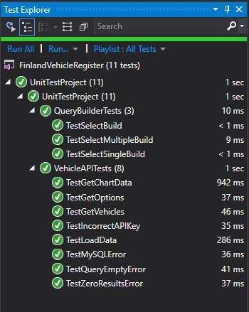

# Yksikkötestaus

Yksikkötestauksessa testattiin QueryBuilderin ja VehicleAPI:n toimivuutta. Pääasiassa tarkistettiin metodien palautteiden oikeellisuus ja kaikki mahdolliset virhetilanteet, kuten MySQLException. Muiden luokkien yksikkötestauksien luomiseen ei jäänyt enää aikaa, joten siksi ne puuttuvat. 